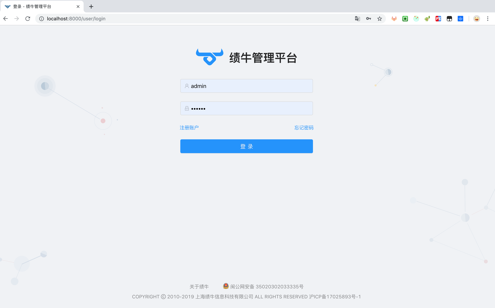

<h1 align="center">绩牛数智营销</h1>

<div align="center">



</div>

## 特性

- :gem: **优雅美观**：基于 Ant Design 体系精心设计
- :triangular_ruler: **常见设计模式**：提炼自中后台应用的典型页面和场景
- :rocket: **最新技术栈**：使用 React/umi/dva/antd 等前端前沿技术开发
- :iphone: **响应式**：针对不同屏幕大小设计
- :art: **主题**：可配置的主题满足多样化的品牌诉求
- :globe_with_meridians: **国际化**：内建业界通用的国际化方案
- :gear: **最佳实践**：良好的工程实践助您持续产出高质量代码
- :white_check_mark: **UI 测试**：自动化测试保障前端产品质量

## 目录结构

```
|
|—— config                   # umi 配置，包含路由，构建等配置
|   └── router.config        # 路由配置
|
├── public
│   └── favicon.png          # Favicon
├── src
│   ├── assets               # 本地静态资源
│   ├── components           # 业务通用组件
│   ├── e2e                  # 集成测试用例
│   ├── layouts              # 通用布局
│   ├── models               # 全局 dva model
│   ├── pages                # 业务页面入口和常用模板
│   ├── services             # 后台接口服务
│   ├── utils                # 工具库
│   ├── locales              # 国际化资源
│   ├── global.less          # 全局样式
│   └── global.js            # 全局 JS
├── tests                    # 测试工具
├── README.md
└── package.json  
```

## 使用

### 使用命令行
```bash
$ npm install
$ npm start         # 访问 http://localhost:8000
$ npm run build     # 打包
```

### 使用 docker

```bash
# preview 
$ docker pull antdesign/ant-design-pro
$ docker run -p 80:80 antdesign/ant-design-pro
# open http://localhost

# dev 
$ npm run docker:dev

# build 
$ npm run docker:build


# production dev 
$ npm run docker-prod:dev

// production build 
$ npm run docker-prod:build
```

更多信息请参考 [使用文档](https://pro.ant.design/docs/getting-started-cn)。

## 支持环境

现代浏览器及 IE11。

| [](http://godban.github.io/browsers-support-badges/)</br>IE / Edge | [](http://godban.github.io/browsers-support-badges/)</br>Firefox | [](http://godban.github.io/browsers-support-badges/)</br>Chrome | [](http://godban.github.io/browsers-support-badges/)</br>Safari | [](http://godban.github.io/browsers-support-badges/)</br>Opera |
| --------- | --------- | --------- | --------- | --------- |
| IE11, Edge| last 2 versions| last 2 versions| last 2 versions| last 2 versions

